# 系統程式第一次程式作業
- 資訊三甲 10612150 林詠翔

## 開發環境與平台
- 開發平台: CPU: Intel i5-6300HQ (4) @ 3.200GHz, Memory: 12G 
- 所選擇的組合語言: SIC & SIC/XE 組合語言
- 使用的程式語言: C++ 11
- 使用開發環境: Linux 64bit (archlinux), vim, g++ (GCC) 9.2.0 C++ 11

本次作業採用c++ 11編寫，並且確保有將編譯器加上參數`-std=c++11 -DNDEBUG`，透過指令進行編譯，採用文字編輯器編寫並透過script執行編譯指令。
``` bash
g++ *.cpp -std=c++11 -DNDEBUG 
```

## 程式設計與流程
### 功能
### 流程
#### Parser
Parser為Recursive Descent Parser的設計，並且採用**深度優先搜尋**，

#### Lexer
lexer會返回內容是token的vector

### 資料結構 Lexer

#### LoadingTable
LoadingTable採用C++ 11中STL的unordered_map，標準函數庫實做大多透過hashTable，
LoadingTable建立兩個方向兩個表，雙向查詢token的`(type, value)`與對映的token string如`add`或`sub`，
而查詢`(type, value)`時透過string作為key找到對映的`(type, value)`，
反向則是`(type, value)`可以對映到string。

#### HashTable
HashTable透過字串中所有的ascii相加後取mod 100的進行索引，裡面含有一個陣列並且保存
碰撞採用linear probing

透過`empty`來判斷是否存放資料，並且透過`value`保存內容值
``` c++
 typedef struct HashTableData {
    bool empty = true;
    string value;
  } HashTableData;
```

而`Instruction`、`PseudoExtra`、`Register`、`Delimiter`皆是採用LoadingTable這個class處理，
而背後實際上是兩個HashTable，`Integer/real`、`String`、`Symbol`皆是採用自己編寫HashTable。

### Assembler
#### OPTAB
#### SYMTAB
#### LITTAB

#### 組譯的方式
Format1與Format2因為格式特性，實做上面透過stringstream輸出nibble產生Object code的16進位值，
產生Object file時只需要將hex code轉成binary的形式即可，而沒有透過位元運算子來計算結果。

Format3與Format4透過位元運算子進行位移，之後在將多個bit疊在一個int上，
最後產生Object code的byte String。

### Parser
Parser為Recursive Descent Parser，設計一個資料結構Syntax List來保存Backus–Naur form Grammar
中定義的文法，每個Grammar可以定義成一個Syntax，而Syntax裡面包含多組Syntax Data，
並且用vector保存`|`隔開的各個部份。

而下圖為Syntax List資料結構表示圖，Parser的RootSyntax會指向其中一個Syntax，
用來作為根進行遞迴下降，之後Syntax中有多個Syntax Data的組合。



#### Syntax Data
一串Syntax Data可以代表Terminal Symbol或Non-Terminal Symbol，
如果為前者則判斷tableType是否符合，否則就判斷後者syntaxID，
而syntaxID是由SyntaxList自行管理，產生Syntax時會返回一個ID。

並且允許配置一個function來檢查Table的內容是否符合文法。
``` c++ 
  typedef struct SyntaxData {
    bool terminal;

    int tableType; // if terminal symbol is true
    int syntaxID; // false

    bool ( *checker)(const string &str); // work for all table
  } SyntaxData;
```

#### Syntax
一個Syntax物件允許管理多個Syntax Data組合，透過二維陣列保存各個Syntax內容。
``` c++ 
  class Syntax {
    typedef vector<SyntaxData> SyntaxGroup;
  public:
    void append(SyntaxGroup);
  };
```

#### Syntax List  
append這個指令會回傳SyntaxList所給予的ID並保存identifer，
可用來定義其他文法，不過定義的時候要注意順序，
使用到空文法應該中斷程式報錯由程式設計師解決。
``` c++ 
  class SyntaxList {
    vector<Syntex> list;
    map<string, int> identiferList;
   public:
     int append(string identifer, Syntax);
     int find(string identifer);
  };
```


## 未完成的功能
- syntax
- SyntaxList資料結構不支援向前參考
- 由於作業只需要輸出Object code的hex，因此尚未支援轉成二進位的機器碼檔案的功能。

